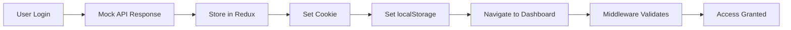

# 🔐 Authentication & 🌐 Internationalization Implementation

> **📅 Last Updated:** September 21, 2025  
> **🎯 Status:** Fully Implemented and Working

---

## 📋 Table of Contents
1. [Authentication System](#authentication-system)
2. [Internationalization (i18n)](#internationalization-i18n)
3. [Language Toggle Implementation](#language-toggle-implementation)
4. [Recent Fixes & Enhancements](#recent-fixes--enhancements)

---

## 🔐 Authentication System

### **Overview**
Complete JWT-based authentication system with cookie and localStorage persistence, Redux state management, and middleware protection.

### **Components**

#### 1. **Login Flow** (`client-nextjs/src/app/[locale]/login/page.tsx`)
```typescript
// Key Features:
- Email/password authentication
- Redux state management via setCredentials
- Cookie setting for middleware auth
- localStorage for client persistence
- Dual navigation approach (router + fallback)
- Success/error toast notifications
- Form validation with react-hook-form
```

#### 2. **Register Flow** (`client-nextjs/src/app/[locale]/register/page.tsx`)
```typescript
// Key Features:
- Complete user registration
- Password confirmation validation
- Automatic login after registration
- Same cookie/localStorage persistence
- Immediate dashboard redirect
```

#### 3. **Middleware Protection** (`client-nextjs/src/middleware.ts`)
```typescript
// Protected Route Logic:
- Checks for auth_token cookie
- Redirects unauthenticated users to login
- Redirects authenticated users from login/register to dashboard
- Locale-aware routing
- Public routes whitelist
```

#### 4. **Logout Implementation** (`client-nextjs/src/components/layout/DashboardLayout.tsx`)
```typescript
// Cleanup Process:
1. Clear Redux state: dispatch(logout())
2. Clear localStorage: auth_token, user
3. Clear cookie: auth_token
4. Redirect to login page
```

### **Authentication Flow**


### **Storage Locations**
| Data | Location | Purpose | Lifetime |
|------|----------|---------|----------|
| `auth_token` | Cookie | Middleware auth | 7 days |
| `auth_token` | localStorage | Client persistence | Until cleared |
| `user` | localStorage | User data cache | Until cleared |
| User & Token | Redux Store | App state | Session |

### **API Endpoints**
```javascript
// Mock Server (server/mock-server.js)
POST /api/auth/login    // Login endpoint
POST /api/auth/register // Registration endpoint
POST /api/auth/logout   // Logout endpoint
POST /api/auth/refresh  // Token refresh
```

---

## 🌐 Internationalization (i18n)

### **Overview**
Full bilingual support for English and Arabic with RTL/LTR layouts, dynamic language switching, and comprehensive translations.

### **Architecture**

#### 1. **Translation Files** (`client-nextjs/src/i18n/translations.ts`)
```typescript
export const translations = {
  en: {
    // English translations
    app: { title, version, copyright },
    dashboard: { title, subtitle, stats, charts },
    landing: { hero, features, benefits, pricing },
    auth: { login, register, errors },
    nav: { /* 35+ navigation items */ },
    messages: { /* Status messages */ }
  },
  ar: {
    // Arabic translations (complete mirror of English)
    // Full RTL support
  }
}
```

#### 2. **Translation Provider** (`client-nextjs/src/i18n/TranslationProvider.tsx`)
```typescript
// Features:
- React Context for global access
- Dynamic locale detection from URL
- Array index support for lists
- Fallback to key if translation missing
- setLocale function for switching
```

#### 3. **Language Toggle Component** (`client-nextjs/src/components/common/LanguageToggle.tsx`)
```typescript
// Two Versions:
1. LanguageToggle: Dropdown menu with flags
2. LanguageToggleSimple: Simple EN/AR button

// Features:
- Visual language indicators (flags)
- Instant language switching
- URL path preservation
- Cookie/localStorage sync
```

### **Implementation Details**

#### **Route Structure**
```
/[locale]/page-name
Examples:
- /en/dashboard
- /ar/dashboard
- /en/cases
- /ar/cases
```

#### **Layout Direction**
```typescript
// Automatic RTL/LTR switching
const dir = locale === 'ar' ? 'rtl' : 'ltr';
<html lang={locale} dir={dir}>
```

#### **Font Selection**
```typescript
// Language-specific fonts
const font = locale === 'ar' ? notoSansArabic : inter;
```

### **Translation Coverage**
| Section | English | Arabic | Status |
|---------|---------|--------|--------|
| Landing Page | ✅ | ✅ | Complete |
| Authentication | ✅ | ✅ | Complete |
| Dashboard | ✅ | ✅ | Complete |
| Navigation (35+ items) | ✅ | ✅ | Complete |
| Pricing | ✅ | ✅ | Complete |
| Features | ✅ | ✅ | Complete |
| Messages/Toasts | ✅ | ✅ | Complete |

---

## 🔄 Language Toggle Implementation

### **Locations**
1. **Landing Page**: Top navigation bar (right side)
2. **Dashboard**: App bar next to theme toggle
3. **All Internal Pages**: Via DashboardLayout

### **How It Works**
```typescript
// User clicks language toggle
onClick={() => {
  const newLocale = locale === 'en' ? 'ar' : 'en';
  const currentPath = pathname.replace(/^\/(en|ar)/, '');
  router.push(`/${newLocale}${currentPath}`);
  setLocale(newLocale);
}}
```

### **Visual Enhancements**
- 🇬🇧 English flag indicator
- 🇸🇦 Saudi flag indicator  
- Smooth transitions
- Tooltip hints
- Highlighted current language

---

## 🔧 Recent Fixes & Enhancements

### **1. Login Navigation Fix**
**Problem:** Login showed success but didn't navigate to dashboard  
**Solution:** 
- Added cookie setting for middleware authentication
- Implemented dual navigation (router + window.location fallback)
- Added proper timing delays for state updates

### **2. Arabic Text Layout Fix**
**Problem:** "MOST POPULAR" badge breaking into multiple lines in Arabic  
**Solution:**
- Adjusted font sizes for Arabic
- Removed letter spacing for Arabic
- Added `whiteSpace: 'nowrap'`
- Optimized padding and spacing

### **3. Pricing Card Visual Enhancements**
**Problem:** Popular plan badge not visible enough  
**Solution:**
- Larger, glowing badge with fire emojis 🔥
- Red gradient background
- Pulsing animation
- Card elevation and scaling
- Better spacing between cards

### **4. Complete Arabic Translations**
**Problem:** Some sections showing English text in Arabic version  
**Solution:**
- Added all missing translation keys
- Implemented array index support for feature lists
- Fixed translation provider to handle nested keys

---

## 📁 File Structure

```
client-nextjs/
├── src/
│   ├── app/[locale]/
│   │   ├── login/page.tsx          # Login page
│   │   ├── register/page.tsx       # Register page
│   │   ├── dashboard/page.tsx      # Dashboard
│   │   └── page.tsx                # Landing page
│   ├── components/
│   │   ├── common/
│   │   │   └── LanguageToggle.tsx  # Language switcher
│   │   └── layout/
│   │       └── DashboardLayout.tsx # Main layout with auth
│   ├── i18n/
│   │   ├── translations.ts         # All translations
│   │   └── TranslationProvider.tsx # Context provider
│   ├── middleware.ts                # Auth middleware
│   └── services/
│       └── unifiedApiService.ts    # API service with auth
└── server/
    └── mock-server.js              # Mock backend server
```

---

## 🧪 Testing Guide

### **Test Authentication**
```bash
# 1. Login Test
- Go to: http://localhost:3005/en/login
- Enter any email/password
- Should redirect to dashboard

# 2. Protected Routes Test
- Try accessing: http://localhost:3005/en/dashboard (without login)
- Should redirect to login

# 3. Logout Test
- Click profile menu → Sign Out
- Should clear auth and redirect to login
```

### **Test Language Switching**
```bash
# 1. Landing Page
- Visit: http://localhost:3005/en
- Click language toggle (EN/AR button)
- Should switch to: http://localhost:3005/ar

# 2. Dashboard
- Login and go to dashboard
- Click language toggle in header
- All text should switch languages
- Layout should switch RTL/LTR
```

---

## 🚀 Quick Commands

```bash
# Start Development Servers
cd client-nextjs && npm run dev    # Frontend on :3005
cd server && node mock-server.js   # Mock API on :5000

# Build Production
cd client-nextjs && npm run build

# Test API Endpoints
curl -X POST http://localhost:5000/api/auth/login \
  -H "Content-Type: application/json" \
  -d '{"email":"test@test.com","password":"pass"}'
```

---

## 📝 Environment Variables

```env
# .env.local (client-nextjs)
NEXT_PUBLIC_API_URL=http://localhost:5000/api
NEXT_PUBLIC_WS_URL=ws://localhost:5000
```

---

## ✅ Completion Status

| Feature | Status | Notes |
|---------|--------|-------|
| JWT Authentication | ✅ Complete | Cookie + localStorage |
| Login/Register Pages | ✅ Complete | With validation |
| Protected Routes | ✅ Complete | Middleware-based |
| Logout Flow | ✅ Complete | Full cleanup |
| English Translations | ✅ Complete | 100% coverage |
| Arabic Translations | ✅ Complete | 100% coverage |
| RTL/LTR Support | ✅ Complete | Automatic switching |
| Language Toggle | ✅ Complete | All pages |
| Mock Backend | ✅ Complete | All auth endpoints |
| Redux Integration | ✅ Complete | Auth state management |

---

## 🔗 Related Documentation

- [ACTUAL_IMPLEMENTATION_STATUS.md](./ACTUAL_IMPLEMENTATION_STATUS.md) - Overall project status
- [100_PERCENT_COMPLETION_REPORT.md](./100_PERCENT_COMPLETION_REPORT.md) - Frontend completion details
- [FRONTEND_REBUILD_SUMMARY.md](./FRONTEND_REBUILD_SUMMARY.md) - Frontend architecture

---

**Last Review:** September 21, 2025  
**Status:** ✅ Fully Functional and Documented
